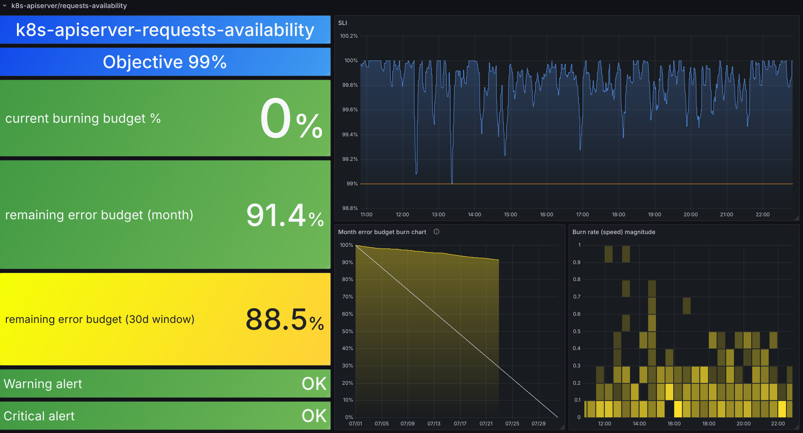
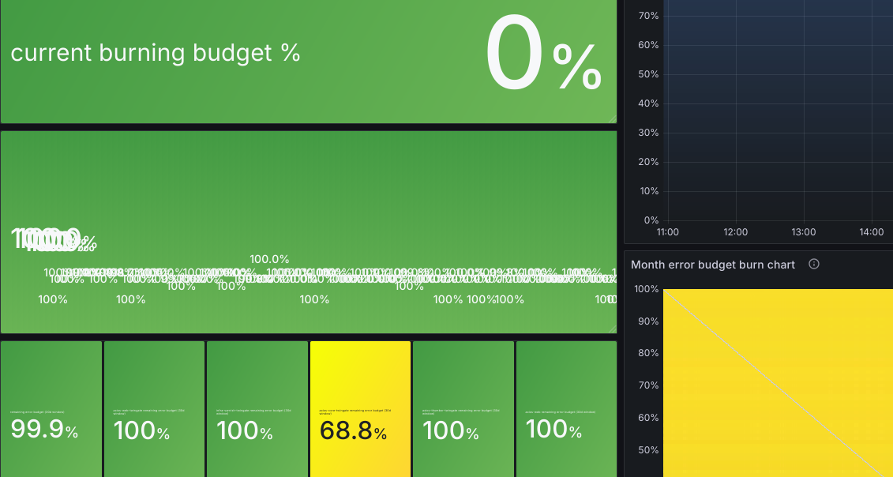

<!-- class: lead invert -->

# __SLO's with Sloth.dev__


__Nicholas Capo__
Senior Infrastructure Engineer
Axios, Inc

## Overview

- SLA / SLO / SLI
- Prometheus
- Sloth
- Problems

## Service Level Agreements

### Example SLA's

> We agree to serve 99.99% of HTTP requests in 200ms
>
> We agree that 90% of all HTTP responses in a month will be 200
>
> We agree that if we don't serve 99.5% of requests in 200ms, we will pay you $1000

### SLA / SLO / SLI

|               | We agree  | to serve | 99.5%     | of HTTP requests in | 200ms     |
| ------------- | --------- | -------- | --------- | ------------------- | --------- |
| Service Level | Agreement |          | Objective |                     | Indicator |
| What          | Contract  |          | Ratio     |                     | Metric    |
| This talk     | 👩‍⚖️🚫      |          | ☝️✅       |                     | 📈        |

## Prometheus Metrics

- Metrics: `http_requests_total`, `http_request_duration_seconds`
- Labels: `method`, `route`, `status`
- Queries: `rate(http_requests_total{method=~"5.."}[10m])`

### Alert Rules: Simple

Availability: More than 10/s HTTP 500

```promql
rate(http_requests_total{method=~"5.."}[10m]) > 10
```

Latency: Higher than 200ms

```promql
histogram_quantile(0.95, sum by (le)(rate(http_request_duration_seconds_bucket[10m]))) > 0.2
```

### Alert Rules: Ratio

Availability

```promql
sum(rate(http_requests_total{status=~"2.."}[10m])) / sum(rate(http_requests_total[10m])) > 0.01
```

Latency

```promql
sum(rate(http_request_duration_seconds_bucket{le="0.2"}[10m])) / sum(rate(http_request_duration_seconds_count[10m])) > 0.05
```

### Really?

- It's down for 10 minutes is not fine?
- It's slow for 10 minutes is not fine?
- It's down sometimes is fine?
- It's slow sometimes is fine?

### An SLO would be better

- Over a month the ratio of "bad"/ "all" is less than 0.5%
- Alert if we __will__ break the "agreement" (quickly, or overall)

## Sloth

- Sloth is a tool to help you generate Prometheus rules for SLOs
- It uses a YAML file to define SLOs

### Sloth SLO Kinds

#### Modes

- CLI mode generates yaml configuration
- Kubernetes Operator reads CRD's (useful with the Prometheus Operator)

#### Kinds

- Default: Only CLI
- Kubernetes: CLI or Operator
- OpenSLO: Only CLI

### Example SLO

```yaml
version: prometheus/v1
service: k8s-apiserver
labels:
  component: kubernetes
slos:
  - name: requests-availability
    objective: 99.9
    description: Warn that we are returning correctly the requests to the clients (kubectl users, controllers...).
    labels:
      category: availability
    sli:
      events:
        error_query: sum(rate(apiserver_request_total{code=~"(5..|429)"}[{{.window}}]))
        total_query: sum(rate(apiserver_request_total[{{.window}}]))
    alerting:
      name: K8sApiserverAvailabilityAlert
      labels:
        category: availability
      annotations:
        runbook: https://example.com
      page_alert:
        labels:
          severity: critical
      ticket_alert:
        labels:
          severity: warning
```

### Generated Results

```bash
$ sloth generate --input=slo.yaml --out=prometheus.yaml

INFO[0000] SLI plugins loaded                            plugins=0 svc=storage.FileSLIPlugin version=dev window=30d
INFO[0000] SLO period windows loaded                     svc=alert.WindowsRepo version=dev window=30d windows=2
INFO[0000] Generating from Prometheus spec               version=dev window=30d
INFO[0000] Multiwindow-multiburn alerts generated        out=prometheus.yaml slo=k8s-apiserver-requests-availability svc=generate.prometheus.Service version=dev window=30d
INFO[0000] SLI recording rules generated                 out=prometheus.yaml rules=8 slo=k8s-apiserver-requests-availability svc=generate.prometheus.Service version=dev window=30d
INFO[0000] Metadata recording rules generated            out=prometheus.yaml rules=7 slo=k8s-apiserver-requests-availability svc=generate.prometheus.Service version=dev window=30d
INFO[0000] SLO alert rules generated                     out=prometheus.yaml rules=2 slo=k8s-apiserver-requests-availability svc=generate.prometheus.Service version=dev window=30d
INFO[0000] Prometheus rules written                      format=yaml groups=3 out=prometheus.yaml svc=storage.IOWriter version=dev window=30d
```

### Recording Rules

```yaml
- record: slo:sli_error:ratio_rate5m
  expr: |
    (sum(rate(apiserver_request_total{code=~"(5..|429)"}[5m])))
    /
    (sum(rate(apiserver_request_total[5m])))
  labels:
    category: availability
    component: kubernetes
    sloth_id: k8s-apiserver-requests-availability
    sloth_service: k8s-apiserver
    sloth_slo: requests-availability
    sloth_window: 5m
```

### Alert Rules

```yaml
- alert: K8sApiserverAvailabilityAlert
  expr: |
    (
        max(slo:sli_error:ratio_rate5m{sloth_id="k8s-apiserver-requests-availability", sloth_service="k8s-apiserver", sloth_slo="requests-availability"} > (14.4 * 0.0009999999999999432)) without (sloth_window)
        and
        max(slo:sli_error:ratio_rate1h{sloth_id="k8s-apiserver-requests-availability", sloth_service="k8s-apiserver", sloth_slo="requests-availability"} > (14.4 * 0.0009999999999999432)) without (sloth_window)
    )
    or
    (
        max(slo:sli_error:ratio_rate30m{sloth_id="k8s-apiserver-requests-availability", sloth_service="k8s-apiserver", sloth_slo="requests-availability"} > (6 * 0.0009999999999999432)) without (sloth_window)
        and
        max(slo:sli_error:ratio_rate6h{sloth_id="k8s-apiserver-requests-availability", sloth_service="k8s-apiserver", sloth_slo="requests-availability"} > (6 * 0.0009999999999999432)) without (sloth_window)
    )
  labels:
    category: availability
    severity: critical
    sloth_severity: page
  annotations:
    runbook: https://example.com
    summary: '{{$labels.sloth_service}} {{$labels.sloth_slo}} SLO error budget burn rate is over expected.'
    title: (page) {{$labels.sloth_service}} {{$labels.sloth_slo}} SLO error budget burn rate is too fast.
```

### Dashboard



## Problems

### Too many labels

```promql
sum by (namespace, job, route)(...)
```

```promql
sum by (namespace, job, grpc_service, grpc_method)(...)
```



### Other Concerns

- Hard to test: need to collect recording data for like 30 days(!)
- Is Sloth unmaintained? Does it matter?
- Is there something better?

## Questions?

| Sloth Homepage                   | Sloth Github                             | Slides                             |
| :------------------------------: | :--------------------------------------: | :--------------------------------: |
| sloth.dev                      | github.com/slok/sloth                    | github.com/nicholascapo/talk-sloth |
|  |  |    |
